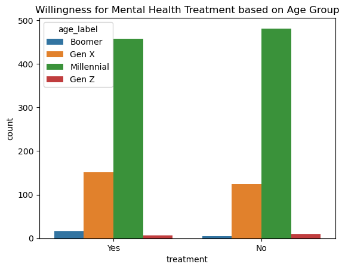
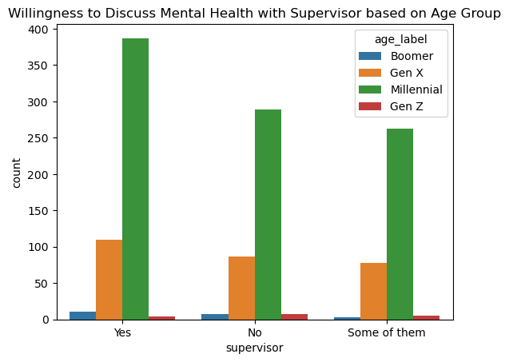
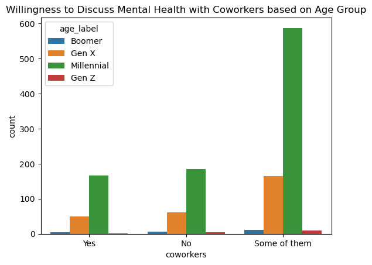

# COSC 301 Project Group 06

## Introduction

Our project is an analysis of a 2014 survey of employee mental health in tech workplaces. The survey interviewed over a thousand respondents and collected twenty seven points of data per respondent across many countries around the world. We are interested in this data as it pertains to our personal lives quite a bit, as each of us are going into tech or tech-related fields and have had struggles with mental health in the past.

---

## Exploratory Data Analysis

During our respective EDAs, we found a variety of interesting pieces of data. An example of this is that a vast majority of the respondents were from the United States on a scale that begs the question of how the survey reached so few people from other countries comparatively speaking.

Another interesting piece of data is that for the 'Age' column, there were 53 unique responses. Out of 1259 people that answered the survey, having only 53 unique ages means that a majority of the tech workers seem to be the same ages.

---

## Question 1 + Results

### Simone Flowers - Is there a correlation between age of an employee in the Tech work industry and them seeking treatment for or discussing their mental health issues

For investigating my research question, I split the respondents to the survey up by age and put them into 4 different categories: Boomer (51+), Gen X (37-51), Millennials (20-36), and Gen Z (19 and lower). Grouping the respondents into these age groups makes it easier to visualize data and compare the answers respondents from different generations.

Back in the day, when mental health issues were not as well known, it was something that was never discussed in public, especially not in a place of work. These days, mental health is not as stigmatized as it was in the past. Nowadays, people are encouraged to find treatment for any mental health issues whether through medication or therapy, and, hopefully, managers, supervisors, and workers see mental health just as important as physical health. The goal of this research is to find out if the age of the tech worker affects their attitude towards mental health. My hypothesis is that the younger generations, Millennials and Gen Z, will be more willing to get treatment for and discuss mental health in the workplace than the older generations, Boomers and Gen X.

According to this bar graph, the younger generations, Millennials and Gen Z, are less willing to get treatment for their mental health issues than the older generations, Boomers and Gen X. So far, this information does not support my hypothesis.

Now that I know the workers' attitude towards getting treatment, the next step is to see their willingness to discuss mental health issues in the workplace.

This count plot shows that Boomers, Gen X, and Millennials answered 'Yes' the most, while Gen Z answered 'No' the most. It seems that the older generations and Millennials are more willing to discuss mental health issues with their supervisor than Gen Z is.

What this last count plot shows is that all age generations are only willing to discuss mental health issues with only some coworkers, and if given the choice, it seems all age generations would choose to not discuss mental health issues with coworkers rather than discuss with all coworkers. I feel like this makes sense as most people only have a few select coworkers they consider friends, and most people also have a support group, be it friends or family, outside of work that they can rely on.

Overall, it seems that there is no distinct correlations between age and willingness to get treatment for or discuss mental health among tech workers. Attitude towards mental health seems to be dependent on the person and not on what era that they grew up in.

The pattern of Gen Z being less willing to discuss mental health at work or get treatment for mental health issues is not what I expected. I expected the opposite of Gen Z, considering that they grew up in a society where mental health is talked about more and realized as important as physical health issues. This pattern may have arisen from that fact that there are significantly less Gen Z respondents than the other generations, or this may be a pattern in Gen Z workers. It would be interesting to see if this pattern persisted in another survey like this if it came out now or in the next few years.

---

## Question 2 + Results

### Soren Stenback - Does Country Of Origin Affect Family History Of Mental Illness?

During my investigation into the data, I first took the graph of number of respondents per country and split it on a yes/no axis of whether or not the respondent had a family history of mental illness.

There are 48 countries in the survey total, with a majority of the respondents located in the United States, United Kingdom, or Canada. For each respondent I only had the data submitted in the survey, but when it comes to the countries themselves I could do further research.

My next step was to add a new column to the dataframe based on what continent each country was a part of. I was doing this in order to group nations together, as several continents in the world have particularly been the victims of periods of strife in recent years.

I still had an extremely high number of North American respondents, which made it difficult to even see the African, Asian, Oceanian, and South American data. I decided to drop the North American data so that I could view the other continents more easily.

We can see quite clearly that every region of the world has a greater number of respondents who answered 'No' to whether or not they had a family history of mental illness, but when we specifically look at regions of the world that have experienced strife (World War II, US-backed coups in South America, military dictatorships in Asia) we see that the disparity between 'Yes' and 'No' answers grows exponentially. The only exception to this rule is Africa, which may be due to the very limited amount of respondents.

Moving further, I used data from the [World Bank](https://datatopics.worldbank.org/world-development-indicators/the-world-by-income-and-region.html) to assign each country an economic index, ranging from 'High Income' to 'Low Income.

Once again, the sheer volume of respondents from countries with high incomes makes it difficult to even see the rest of the data. As such, I chose to drop 'High Income' data as I can see above that while there are more 'No' answers it continues to follow the trend of having much more equal results than other criteria.

We can see that the evidence seems to support the hypothesis, as countries with what are considered to be 'lesser' economies have respondents answer 'No' to whether or not they have a family history of mental health with much greater frequently.

The final piece of data I examined was the Yes/No axis based on the country of origin's alignment during the Cold War. I was of the opinion that countries such as Bulgaria, which were part of the former Soviet bloc, would not have had good mental healthcare systems in place while under their authoritarian regimes and as such many respondents from those countries would not have family histories of mental health simply because they had not been diagnosed or records had not been kept. I utilized the [Wikipedia article on the Cold War](https://en.wikipedia.org/wiki/Cold_War) to identify which 'World' each country was a part of.

Thankfully the data is balanced enough for us to be able to visualize each bar without needing to drop any data. The 'First World' countries once again follow the trend of having much more balanced data, while 'Second World' and 'Third World' countries have far greater percentages of 'No' answers.

With all the data I collected during my analysis, I believe that my hypothesis is supported. It is not a definite answer, but it is an interesting set of trends that supports further research.

---

## Question 3 + Results

### Eveline Question Text

---

## Conclusion
