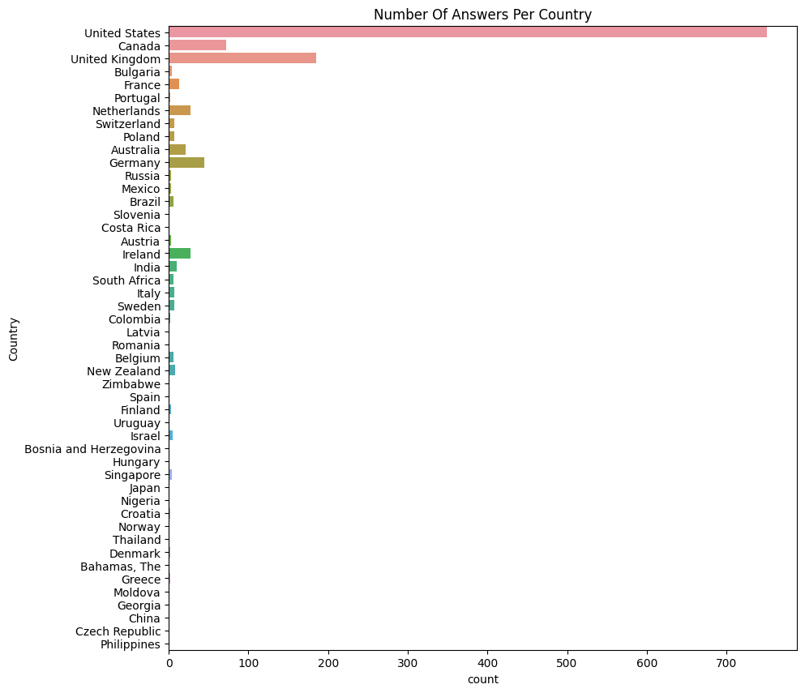
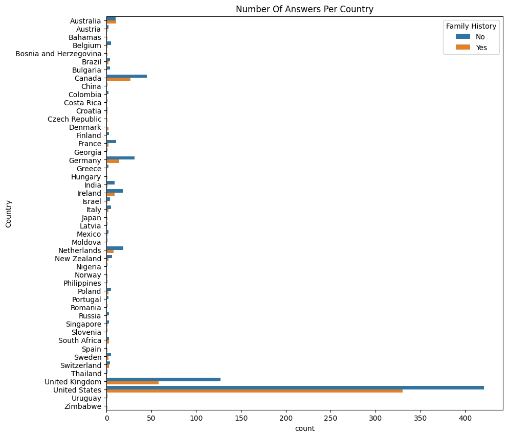
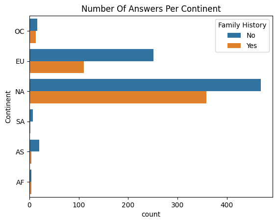
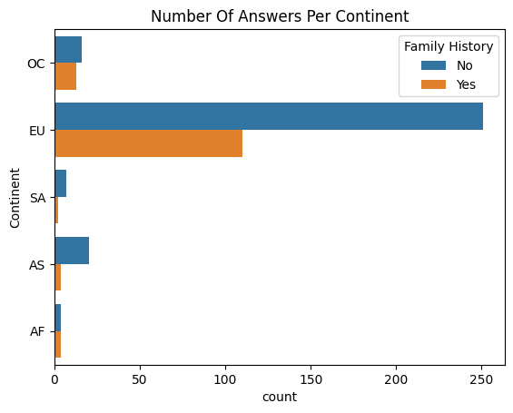
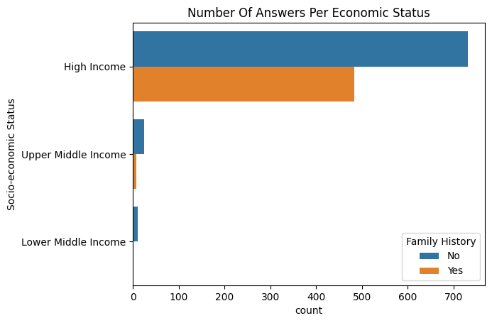
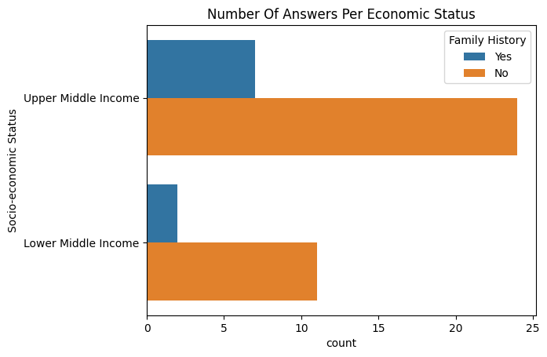
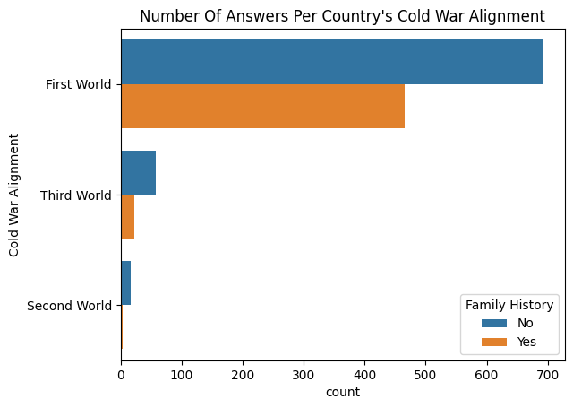

# COSC 301 Project Group 06

## Introduction

Our project is an analysis of a 2014 survey of employee mental health in tech workplaces. The survey interviewed over a thousand respondents and collected twenty seven points of data per respondent across many countries around the world. We are interested in this data as it pertains to our personal lives quite a bit, as each of us are going into tech or tech-related fields and have had struggles with mental health in the past.

---

## Exploratory Data Analysis

During our respective EDAs, we found a variety of interesting pieces of data. An example of this is that a vast majority of the respondents were from the United States on a scale that begs the question of how the survey reached so few people from other countries comparatively speaking.

---

## Question 1 + Results

### Simone Question Text

---

## Question 2 + Results

### Soren Stenback - Does Country Of Origin Affect Family History Of Mental Illness?

During my investigation into the data, I first took the graph of number of respondents per country and split it on a yes/no axis of whether or not the respondent had a family history of mental illness.

There are 48 countries in the survey total, with a majority of the respondents located in the United States, United Kingdom, or Canada. For each respondent I only had the data submitted in the survey, but when it comes to the countries themselves I could do further research.

My next step was to add a new column to the dataframe based on what continent each country was a part of. I was doing this in order to group nations together, as several continents in the world have particularly been the victims of periods of strife in recent years.

I still had an extremely high number of North American respondents, which made it difficult to even see the African, Asian, Oceanian, and South American data. I decided to drop the North American data so that I could view the other continents more easily.

We can see quite clearly that every region of the world has a greater number of respondents who answered 'No' to whether or not they had a family history of mental illness, but when we specifically look at regions of the world that have experienced strife (World War II, US-backed coups in South America, military dictatorships in Asia) we see that the disparity between 'Yes' and 'No' answers grows exponentially. The only exception to this rule is Africa, which may be due to the very limited amount of respondents.

Moving further, I used data from the [World Bank](https://datatopics.worldbank.org/world-development-indicators/the-world-by-income-and-region.html) to assign each country an economic index, ranging from 'High Income' to 'Low Income.

Once again, the sheer volume of respondents from countries with high incomes makes it difficult to even see the rest of the data. As such, I chose to drop 'High Income' data as I can see above that while there are more 'No' answers it continues to follow the trend of having much more equal results than other criteria.

We can see that the evidence seems to support the hypothesis, as countries with what are considered to be 'lesser' economies have respondents answer 'No' to whether or not they have a family history of mental health with much greater frequently.

The final piece of data I examined was the Yes/No axis based on the country of origin's alignment during the Cold War. I was of the opinion that countries such as Bulgaria, which were part of the former Soviet bloc, would not have had good mental healthcare systems in place while under their authoritarian regimes and as such many respondents from those countries would not have family histories of mental health simply because they had not been diagnosed or records had not been kept. I utilised the [Wikipedia article on the Cold War](https://en.wikipedia.org/wiki/Cold_War) to identify which 'World' each country was a part of.

Thankfully the data is balanced enough for us to be able to visualise each bar without needing to drop any data. The 'First World' countries once again follow the trend of having much more balanced data, while 'Second World' and 'Third World' countries have far greater percentages of 'No' answers.

With all the data I collected during my analysis, I believe that my hypothesis is supported. It is not a definite answer, but it is an interesting set of trends that supports further research.

---

## Question 3 + Results

### Eveline Question Text

---

## Conclusion
